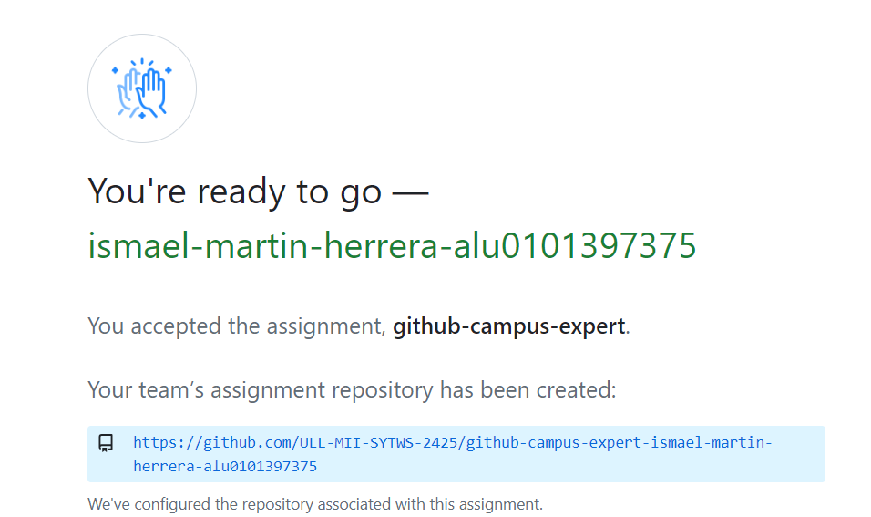
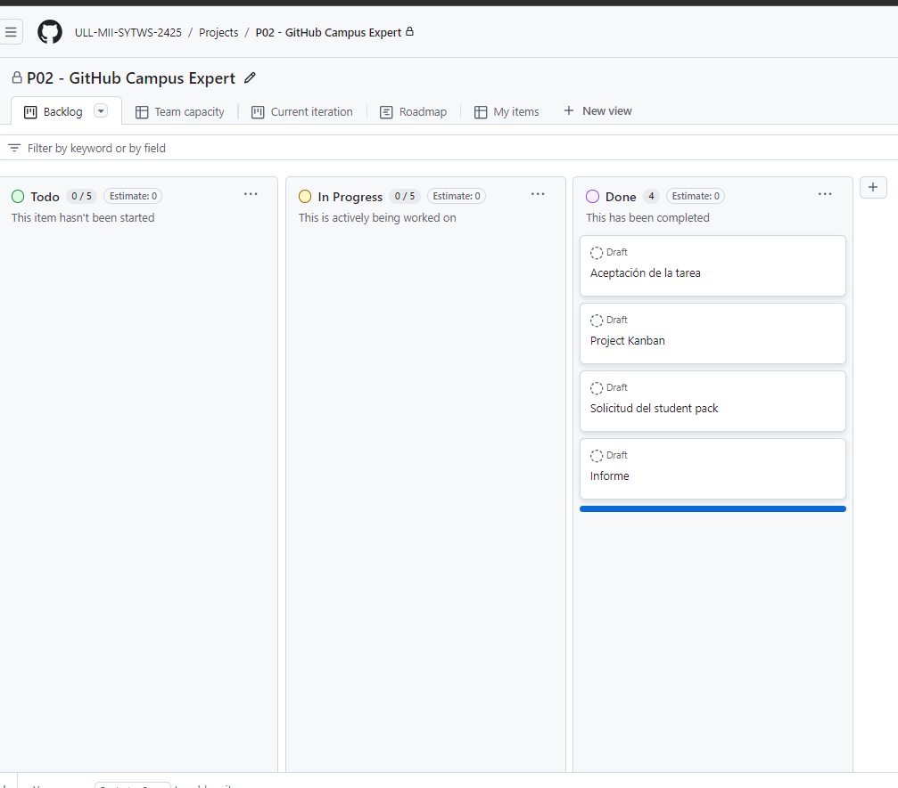
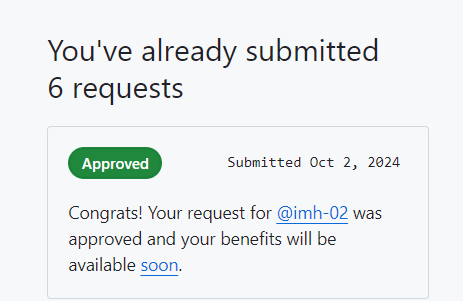
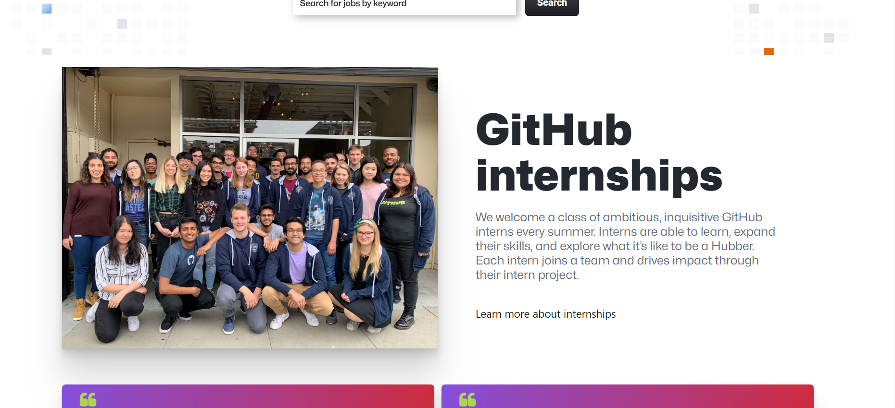

# Práctica 2 - GitHub Campus Expert

Ismael Martín Herrera - _alu0101397375@ull.edu.es_

### 1. Aceptar la asignación de la práctica

Se acepta la asignación de la práctica

### 2. Creación del project board automated kanban
Se crea el Kanban para gestionar los requisitos de la práctica. 

### 3. Solicitar el Student developer pack
Se solicita el Student developer pack tal y está aprovado tal y como se observa en la imagen siguiente. 

### 4. GitHub Internship 

Se accede a la web de GitHub intership y se explora la información contenida en la misma. 

